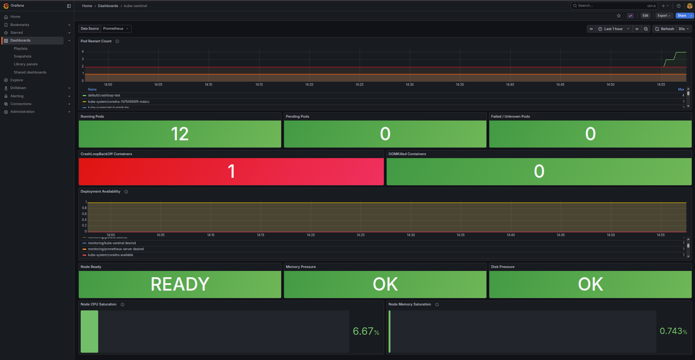

# kube-sentinel

[](https://github.com/igalhub/kube-sentinel/actions/workflows/ci.yml)

A Kubernetes cluster health exporter that surfaces pod, node, and
deployment health as Prometheus metrics — with pre-built Grafana
dashboards and Alertmanager rules, deployed via Terraform + Helm.



> **What this is:** A complete, self-contained monitoring solution for
> small Kubernetes clusters. One `terraform apply` deploys the exporter,
> Prometheus, Grafana, and Alertmanager onto your cluster. No commercial
> accounts, no operators, no 40-CRD installations.
>
> **What this is not:** A replacement for kube-prometheus-stack on large
> clusters, or a commercial APM. See [Gaps vs existing tools](#gaps-vs-existing-tools).

---

## The problem

`kubectl get pods` shows you current state. It doesn't tell you when
something silently breaks.

A pod in CrashLoopBackOff briefly shows "Running," then "Error," then
restarts — forever, until someone notices. A node under MemoryPressure
causes intermittent pod failures with no obvious cause. A deployment
with unavailable replicas looks fine until a user reports an error.

kube-sentinel detects these patterns by scraping the Kubernetes API
every 30 seconds and exposing the results as Prometheus metrics, which
Grafana visualizes and Alertmanager alerts on.

---

## What kube-sentinel detects

### Pod health

| Problem | Metric | Signal |
|---|---|---|
| Crash-loop restart | `kube_sentinel_pod_restart_count` | Restart count climbing |
| CrashLoopBackOff | `kube_sentinel_pod_container_state{reason="CrashLoopBackOff"}` | Container stuck in waiting with this reason |
| OOMKilled | `kube_sentinel_pod_container_state{reason="OOMKilled"}` | Container was killed by the kernel for exceeding memory limit |
| Image pull failure | `kube_sentinel_pod_container_state{reason="ErrImagePull"}` | Wrong tag, missing credentials |
| Not ready | `kube_sentinel_pod_ready{} == 0` | Pod running but failing readiness probe |
| Pending | `kube_sentinel_pod_phase{phase="Pending"}` | Pod stuck — insufficient resources, wrong node selector, PVC not bound |
| Failed / Unknown | `kube_sentinel_pod_phase{phase="Failed"}` | Terminal failure or lost contact with node |

### Node health

| Problem | Metric | Signal |
|---|---|---|
| Node not ready | `kube_sentinel_node_ready{} == 0` | Node unreachable or control plane lost contact |
| Memory pressure | `kube_sentinel_node_condition{condition="MemoryPressure"}` | Node evicting pods to reclaim memory |
| Disk pressure | `kube_sentinel_node_condition{condition="DiskPressure"}` | Node running low on disk — affects image pulls and log storage |
| PID pressure | `kube_sentinel_node_condition{condition="PIDPressure"}` | Node approaching PID limit |
| Resource saturation | `kube_sentinel_node_requested_*` vs `kube_sentinel_node_allocatable_*` | Requested resources approaching allocatable capacity |

### Deployment health

| Problem | Metric | Signal |
|---|---|---|
| Unavailable replicas | `kube_sentinel_deployment_replicas_unavailable > 0` | Desired count not met |
| Partial availability | `kube_sentinel_deployment_replicas_ready < _desired` | Some replicas running, some not |

### What kube-sentinel does NOT detect

Being explicit about scope:

- **Application-level errors** — a pod returning 500s to every request
  looks healthy from the outside. kube-sentinel sees K8s runtime state,
  not what's inside the application.
- **Log content** — metrics only. No log aggregation.
- **PersistentVolume health** — PV bound/released/failed state is a
  natural v2 addition, not in v1.
- **Custom resources (CRDs)** — ArgoCD Application health, Istio
  VirtualService state, etc. require per-CRD integration.
- **Multi-cluster** — monitors a single cluster only.
- **Real-time detection** — the exporter polls every 30 seconds (list,
  not watch). Up to 30s lag between a failure and it appearing in
  metrics. This is a deliberate tradeoff — watch-based streaming is
  more responsive but significantly more complex to implement and test.

---

## Gaps vs existing tools

| Tool | What it does | Why kube-sentinel is different |
|---|---|---|
| `kubectl get pods` | Shows current state, manually | Not proactive, no alerting, no history |
| kube-prometheus-stack | Full monitoring suite | ~40 CRDs, multiple operators, significant operational overhead |
| Datadog / New Relic | Commercial APM | $500+/month, not self-hosted |
| kube-state-metrics | Exposes K8s state as Prometheus metrics | Metrics layer only — requires Prometheus, Grafana, and Alertmanager already running and configured. kube-sentinel is a complete deployable package. |
| metrics-server | Resource usage (CPU/memory) | CPU/memory only — no pod phase, container state, or restart reasons |

kube-sentinel's position: a complete, self-contained monitoring
solution that goes from zero to working dashboards in one command,
targeting small clusters that don't need kube-prometheus-stack's
full complexity.

---

## Architecture

```
Kubernetes cluster (minikube)
  │
  ├── kube-sentinel (Deployment, 1 replica)
  │     └── Python service
  │           ├── authenticates via in-cluster ServiceAccount
  │           │   (mounted token — no kubeconfig needed)
  │           ├── scrapes K8s API every 30s
  │           │     ├── list pods (all namespaces)
  │           │     ├── list nodes
  │           │     └── list deployments (all namespaces)
  │           └── GET /metrics → Prometheus text format
  │
  ├── Prometheus
  │     └── scrapes kube-sentinel /metrics every 30s
  │
  ├── Grafana
  │     ├── datasource → Prometheus (pre-provisioned)
  │     └── dashboard → kube-sentinel panels (pre-provisioned via ConfigMap)
  │
  └── Alertmanager
        └── alert rules: CrashLoopBackOff, node pressure,
            unavailable replicas (pre-configured)

Terraform (runs locally, provisions the above)
  └── kubernetes + helm providers
        ├── namespace: monitoring
        ├── RBAC: ServiceAccount, ClusterRole, ClusterRoleBinding
        ├── Helm: prometheus-community/prometheus (minimal install)
        ├── Helm: grafana/grafana
        ├── Helm: kube-sentinel (built from this repo)
        └── ConfigMaps: Grafana dashboard JSON, Alertmanager rules
```

### Why in-cluster ServiceAccount, not kubeconfig?

A pod inside the cluster authenticates to the K8s API via a mounted
ServiceAccount token — no kubeconfig file, no credentials to manage,
works identically on minikube and any managed cluster. This is the
correct, production-appropriate pattern. kubeconfig-based auth is for
out-of-cluster tools (kubectl, Terraform itself).

### Why minimal Prometheus, not kube-prometheus-stack?

kube-prometheus-stack installs ~40 CRDs, multiple operators, and many
components that would dwarf the exporter itself. For a focused project
demonstrating a custom exporter, a minimal Prometheus + Grafana
installation is cleaner and more honest about what the project
actually does. The tradeoff: no node-exporter or kube-state-metrics
pre-installed — kube-sentinel covers the most important K8s health
signals directly.

---

## Metrics reference

### Pod metrics
```
kube_sentinel_pod_restart_count{namespace, pod, container}
kube_sentinel_pod_ready{namespace, pod}
kube_sentinel_pod_phase{namespace, pod, phase}
kube_sentinel_pod_container_state{namespace, pod, container, state, reason}
```

### Node metrics
```
kube_sentinel_node_ready{node}
kube_sentinel_node_condition{node, condition}
kube_sentinel_node_allocatable_cpu_cores{node}
kube_sentinel_node_allocatable_memory_bytes{node}
kube_sentinel_node_requested_cpu_cores{node}
kube_sentinel_node_requested_memory_bytes{node}
```

### Deployment metrics
```
kube_sentinel_deployment_replicas_desired{namespace, deployment}
kube_sentinel_deployment_replicas_available{namespace, deployment}
kube_sentinel_deployment_replicas_ready{namespace, deployment}
kube_sentinel_deployment_replicas_unavailable{namespace, deployment}
```

### Exporter self-metrics
```
kube_sentinel_scrape_duration_seconds
kube_sentinel_scrape_errors_total
kube_sentinel_up
```

---

## Setup

**Prerequisites:**
- minikube running (`minikube start --driver=docker`)
- kubectl configured (`kubectl get nodes` shows Ready)
- Terraform installed (`terraform version`)
- Helm installed (`helm version`)
- Docker installed (to build the exporter image)

```bash
git clone git@github.com:igalhub/kube-sentinel.git
cd kube-sentinel
```

### Build the exporter image

```bash
eval $(minikube docker-env)   # point Docker at minikube's daemon
docker build -t kube-sentinel:latest .
```

`eval $(minikube docker-env)` is required — it points your local Docker
CLI at minikube's internal Docker daemon so the image is available
inside the cluster without a registry push.

### Deploy with Terraform

```bash
cd terraform
terraform init
terraform apply
```

This provisions:
- `monitoring` namespace
- RBAC (ServiceAccount with read-only cluster access)
- Prometheus (minimal install)
- Grafana (with pre-provisioned dashboard)
- Alertmanager (with pre-configured alert rules)
- kube-sentinel exporter

### Access the dashboards

```bash
# Grafana
minikube service grafana -n monitoring --url
# Default credentials: admin / admin (change on first login)

# Prometheus
minikube service prometheus-server -n monitoring --url

# kube-sentinel /metrics directly
minikube service kube-sentinel -n monitoring --url
```

### Teardown

```bash
cd terraform
terraform destroy
```

---

## Running tests

**Offline suite (no cluster required — what CI runs):**
```bash
python3 -m venv .venv
source .venv/bin/activate
pip install -r requirements-dev.txt
pytest -m "not k8s" -v
```

**Live K8s tests (requires minikube running):**
```bash
pytest -m k8s -v
```

Live tests deploy real pods as fixtures (a crash-looping pod, a pod
with a failing readiness probe, a deployment with unavailable replicas)
and confirm the exporter surfaces the correct metrics. Fixtures are
cleaned up after each test.

---

## Platform support

| Component | minikube | EKS / GKE / AKS | On-prem K8s |
|---|---|---|---|
| Exporter (in-cluster) | ✅ Tested | ⚠️ Should work — in-cluster SA auth is standard | ⚠️ Should work |
| Terraform provisioning | ✅ Tested | ❌ Not in scope — managed cluster provisioning differs | ❌ Not in scope |
| Helm charts | ✅ Tested | ⚠️ Charts are standard; Terraform provisioning untested | ⚠️ Untested |

Developed and tested on Ubuntu 24.04, minikube v1.38.1,
Kubernetes v1.35.1, Terraform v1.x, Helm v3.21.2.

---

## What's not in v1

**PersistentVolume health** — PV bound/released/failed state is a
legitimate monitoring target, deferred to v2.

**Watch-based streaming** — the exporter polls (list) rather than
streams (watch). Real-time detection would require a more complex
reconciliation loop. The 30s polling interval is a deliberate
tradeoff documented here, not a bug to fix later.

**Multi-cluster** — single-cluster only. Multi-cluster aggregation
requires a different architecture (Thanos, Cortex, or a dedicated
federation layer).

**Managed cloud cluster provisioning** — the Terraform code targets
minikube. EKS/GKE/AKS provisioning (VPC, node groups, IAM roles)
is out of scope and would require cloud-provider-specific modules.

---

## Related projects

- **[docker-sentinel](https://github.com/igalhub/docker-sentinel)** —
  the same silent-failure detection pattern for single-host Docker
  containers. kube-sentinel extends this thinking to cluster-level
  Kubernetes health using the proper observability primitives
  (Prometheus metrics, Grafana dashboards, Alertmanager alerts).
- **[Expiry Watcher](https://github.com/igalhub/expiry-watcher)** —
  TLS certificate and Vault credential expiry monitoring.
- **[Vault Secrets Demo](https://github.com/igalhub/vault-secrets-demo)**
  — secrets management reference implementation using HashiCorp Vault.

---

## License

[MIT](LICENSE) — free to use, modify, and distribute.

---

*Built by [Igal](https://github.com/igalhub) as part of a DevOps
portfolio — actively looking for DevOps / SRE / platform engineering
roles.*
